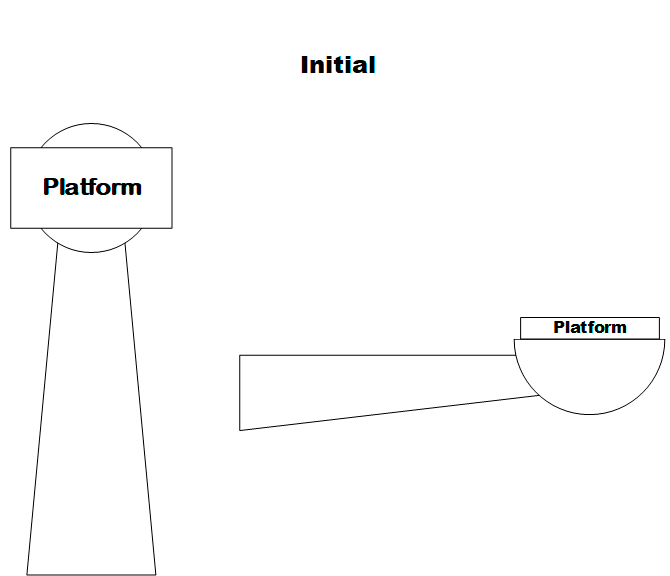

<h1 align="center">pyPelco-P</h1>



## Description  

---

### Theory :mortar_board:

<p align="justify"> Сlass Pelco-P is designed to control a PTZ-camera with the protocol of the same name. Used over the RS482/485 interface to communicate with cameras equipped with servo drives.</p>

#### Message Structure

Byte| Value|Function| 
:--:|:----:|:-------:| 
1   |#A0|STX (transmission start)|
2   |#00 to #1F|Adress|
3   |Data 1|Control command|
4   |Data 2|Control command|
5   |Data 3|Control command|
6   |Data 4|Control command|
7   |#AF| ETX (transmission stop)|
6   |#00 to #FF|Checksum|

The checksum is the sum for the exclusive OR, i.e. XOR, byte from the 1st to 7th.
A set of standard control commands can be viewed [here](https://www.epiphan.com/userguides/LUMiO12x/Content/UserGuides/PTZ/3-operation/PELCOPcommands.htm).
The following **control commands** are included in the class:
* Left;
* Right;
* Up;
* Down;
* Stop;
* Set Preset;
* Clear Preset;
* Call Preset;
* Query Tilt Position.

#### Examples of commands
Rotation to left: A0 00 00 04 20 00 AF 2B
Rotation to right: A0 00 00 02 20 00 AF 2D

---

### Features :fire:
**Sample code**

```

if __name__ == '__main__':
	
	pelco = Pelco_P('COM3')
	pelco.init_position() #class method that provides setting the platform to its original positio
	pelco.set_new_position([x,y]) #class method ensures that the platform moves to a new position in degrees
			
```

--- 

### Requirements :link:: serial

---

TAGS :label:: Pelco-P, Pelco-D, camera platform
